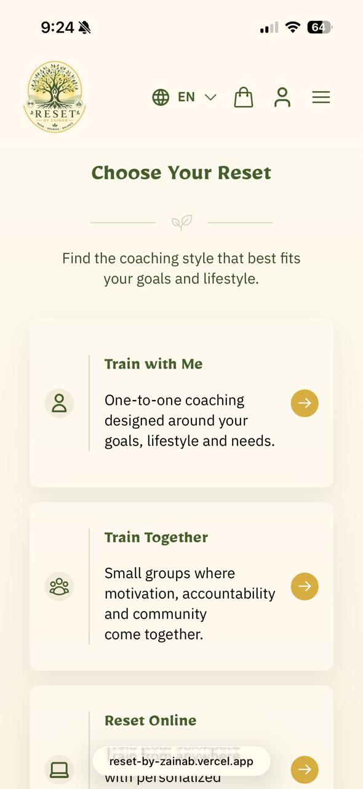

# 💚 Reset

A modern fitness platform built for **Reset by Zainab**, allowing clients to book personal training sessions, join small group classes, purchase online coaching plans, and manage their orders through a seamless bilingual experience.

Designed with a clean, responsive interface and powered by a FastAPI backend, Reset combines secure authentication, online payments, and an intuitive trainer dashboard into one complete fitness management platform.

---

## 📸 Preview

### Homepage

### Services

### Trainer Dashboard

---

## ✨ Features

### Client

- 🔐 Secure authentication with Clerk
- 📧 Email verification during registration
- 🌍 Full Arabic & English support
- 📱 Responsive design
- 🛒 Shopping cart
- 💳 Secure online payments
- 📋 Order history
- 📞 Phone number validation
- 🏋️ Browse training services
- 📦 Purchase session packages
- 💬 Contact form

### Trainer

- 📊 Trainer dashboard
- 👥 View active clients
- 📦 Manage customer orders
- 🔍 Search orders
- 🎯 Filter by status
- 🔄 Sort by newest or oldest
- 📄 View complete order details

---

## 🛠 Tech Stack

### Frontend

- React
- Vite
- React Router
- Clerk Authentication
- i18next
- CSS3

### Backend

- FastAPI
- SQLModel
- PostgreSQL
- SQLAlchemy
- Pydantic

### Payments

- Moyasar

### Deployment

- Vercel
- Render
- 
---

# 🌍 Internationalisation

Reset supports both:

- 🇬🇧 English
- 🇸🇦 Arabic

The interface automatically adapts for both **LTR** and **RTL** layouts.

---

# 🔐 Authentication

Authentication is powered by **Clerk**.

Features include:

- Sign up
- Login
- Email verification
- Password reset
- Protected routes
- Trainer role support

---

# 💳 Payments

Payments are securely processed using **Moyasar**.

Features include:

- Secure checkout
- Payment verification
- Order creation after successful payment
- Failed payment handling

---

# 📊 Trainer Dashboard

The trainer dashboard provides a central place to manage customers.

Features include:

- Recent orders
- Active clients
- Search functionality
- Status filters
- Pagination
- Order details modal

---

# 📱 Responsive Design

Reset is fully responsive across desktop, tablet and mobile devices.

---

# 🎨 Design

The application focuses on a calm, minimal aesthetic inspired by modern fitness brands.

Design highlights include:

- Soft colour palette
- Clean typography
- Accessible layout
- Responsive components
- Smooth user experience
- Bilingual interface

---

# 👩‍💻 Author

**Fatimah Aljishi**

GitHub: https://github.com/FatimahAljishi

LinkedIn: https://www.linkedin.com/in/fatimah-aljishi/
